# Speech Bubble Comic Editor App

> **Migration status:** Phase 5 complete. The standalone v0.1.8 baseline now includes Forge Neo 0.7.10 Quick Retouch plus standalone-relevant processing, multi-text, drawer-state, Supersample, and bilingual UI parity fixes. Phase 6 release/regression validation is next.

生成画像・既存画像を、漫画ページや4コマへ編集・仕上げする、Windows向けローカル漫画エディターです。

「一枚画像」「縦4コマ漫画」「自由コミック」の3つの独立ワークスペースを備えています。吹き出し、文字、縦書き、SFX、スタンプ、フレーム、集中線を重ね、画像の配置からコマ割り、背景処理、書き出しまでを1つのアプリで行えます。

AI生成画像を漫画表現へ仕上げる用途を主な対象としつつ、既存のイラストや写真素材にも利用できます。ローカルで動作し、プロジェクト保存、自動復元、AI背景削除、コミック変換、背景パターン、斜め境界を含むコミックページ編集に対応しています。

> **Local post-production comic editor for AI-generated and existing artwork.**

## 開発経緯

このリポジトリは [Speech Bubble 4koma Editor](https://github.com/ukr8b3g-cmyk/Speech-Bubble-4koma-Editor) の後継アプリです。Phase 1ではv0.1.8のスタンドアロン機能とプロジェクト互換性を維持したまま、製品・実行ファイル・保存領域を独立させています。

本作のベースは、ComfyUI向けカスタムノードの[Speech-Bubble-Layer](https://github.com/ukr8b3g-cmyk/Speech-Bubble-Layer)です。これをForge Neo向けに移植・拡張したものが[sd-webui-speech-bubble-forge-neo](https://github.com/ukr8b3g-cmyk/sd-webui-speech-bubble-forge-neo)で、本作はそのEditorをWindows向けのスタンドアロンアプリとして発展させています。

単なる移植ではなく、縦4コマ漫画制作、漫画ページとコマのレイヤー構造、コミック変換、プロジェクト保存、Desktop設定、システムフォント連携などの機能を追加しています。また、元のEditorを基礎に、描画・書き出しの一致、縦書き、素材管理、復元、操作性などの不具合修正と改善も継続しています。

## 配布状況

後継版は現在移植作業中です。開発中のテスト用インストーラー／EXEは正式リリースではありません。

移植元の安定版は [Speech Bubble 4koma Editor v0.1.8](https://github.com/ukr8b3g-cmyk/Speech-Bubble-4koma-Editor/releases) です。

## 起動

- インストーラー版: セットアップEXEを実行すると、必要なファイル一式をユーザー領域へ配置し、スタートメニューへ登録します。必要に応じてデスクトップショートカットも作成できます。
- Gitで取得: `git clone https://github.com/ukr8b3g-cmyk/Speech-Bubble-Comic-Editor-App.git`
- 初回: `setup_and_start.cmd`
- 2回目以降: `start.cmd`

ソース版だけが専用`.venv`を使用します。ビルド済みEXEはPythonや`.venv`を別途用意せず起動できます。二重起動は防止され、起動エラーはローカルのログへ記録されます。

上部の「新規プロジェクト」または`Ctrl+N`で、現在の作品を閉じて新しい編集を開始できます。未保存の変更がある場合は、保存、保存せず作成、キャンセルを選択します。アプリの終了はWindows標準の右上「×」または`Alt+F4`を使用し、未保存時は同じ確認を経由します。

### EXE版とHTML直接表示の違い

通常はEXE版、または`start.cmd`から起動してください。EXE版ではシステムフォント、日本語フォント、Settings、`.sbeproj`、指定フォルダーへの画像書き出しなど、Desktop APIを使う機能を利用できます。

後継版の新しい配布物はまだ公開していません。ソースから起動する場合は`setup_and_start.cmd`で専用`.venv`を準備し、以後は`start.cmd`を使用してください。移植元v0.1.8の配布物は旧リポジトリのReleasesから取得できます。

`web\speech-bubble-editor.html`の直接表示は旧版互換・UI確認用で、現在のDesktopリリースと同等の動作を保証しません。ブラウザーからDesktop APIへ接続しないため、システムフォント、Settings、`.sbeproj`、指定フォルダーへの書き出しなども利用できません。

## 主な機能

### Phase 4で追加した移植機能

- Forge Neo 0.7.10の「簡易レタッチ / Quick Retouch」をDesktop版へ移植
- ブラシ、消しゴム、スポイト、矩形／投げ縄／自動選択、色域選択、Quick Mask
- Hue / Saturation、Brightness / Contrast、Tone Curve、ペイント／調整レイヤー、Undo / Redo、比較表示
- 一枚画像では元画像レイヤーを保持したままレタッチ結果を新規画像レイヤーとして追加
- 4コマ／コミックではレタッチ結果をPage Imagesへ追加し、既存の画像配置経路で利用
- `.sbeproj` / Project Schemaは変更せず、Quick Retouch内部履歴は一時編集状態として扱う

### Phase 3で追加した移植機能

- 一枚画像／4コマ漫画／コミックの3モードで非破壊クロップ。クロップ状態を保持し、リセット／再編集に対応
- 4コマ／コミックのコマ画像に回転を追加し、クロップ・回転・反転・不透明度・Cover/Contain・拡大率・オフセットを同じ描画経路で処理
- 複数選択した素材を、選択範囲／共通コマ／ページ基準で左右・上下・中央へ整列
- 3個以上の選択素材を水平／垂直に均等配置
- 複数選択時の相対位置を維持した一括回転

### v0.1.8の主な修正

- コミックのページ画像を削除しても、Undo時に画像Blobを再利用してサムネイル・コマ画像・プロジェクト保存を復元
- コマ個別ロックをPropertiesの境界スライダーと結合ボタンにも反映
- コマ割りロック中はテンプレート変更を無効化し、ページ構造の意図しない置き換えを防止
- WindowsのFileVersion／ProductVersionを`0.1.8.0`として収録

### v0.1.6の主な追加・改善

- 第3の編集モード「コミック」を追加。標準5コマから、縦横分割、コマ結合、表示／非表示、斜め境界、一定幅のコマ間隔を編集
- 境界の両端ハンドルで角度を変更し、中央ハンドルまたは境界線のドラッグで角度を保ったまま平行移動
- `Shift`を押しながら境界端をドラッグすると15度刻みで吸着。水平／垂直付近は通常操作でも吸着
- コミックでも4コマと同じページ画像トレイ、コマ画像、Speech Bubbles、Text、SFX、Stamps、Frames、Emphasis Linesを利用可能
- AI背景削除へ自動選択ツールとエッジカラー補正を追加。フリンジ、不要色、白マット、黒マットを非破壊で補正
- 4コマ漫画は新規作成時のコマ割りロックを解除し、すぐにコマ高さと見出しを調整可能

- AI背景削除とマスク編集、コミック変換をDesktop版へ追加
- 一枚画像を複数画像レイヤーで扱い、処理結果を新規レイヤーとして保持
- Canvas背景の23種類の内蔵プロシージャルパターン
- Layersの複数選択、一括操作、コーナー装飾を含むBuilt-inスタンプ
- 未保存確認をWindowsの右上「×」と`Alt+F4`へ統一

- 一枚画像／縦4コマ漫画／コミックの独立した編集状態と自動保存・復元
- 720×2200の標準4コマ、キャンバス寸法・余白・コマ間隔・枠線・背景色の即時反映
- PNG／JPEG／WebPのドラッグ配置、ページ画像トレイ、使用中画像を含む削除
- LayersのCtrl／Shift複数選択、一括移動・拡大縮小・表示・ロック・削除
- アニメ画像を白黒漫画調へ変換する「コミック変換」。4コマのページ画像追加と、一枚画像の新規画像レイヤー追加に対応
- isnet-animeを使うローカルAI背景削除とマスク編集。4コマのページ画像追加と、一枚画像の新規画像レイヤー追加に対応
- Ctrl＋ホイールでコマ内画像を拡大縮小、左ドラッグで移動。通常ホイールはキャンバス全体を拡大縮小
- SFX／Stamps／Speech Bubbles／Emphasis Linesをページ上または選択コマ内へ配置し、コマ内では枠でクリップ
- Speech Bubbles、SFX、Stamps、Frames、Emphasis Lines、Text
- Emphasis Linesのクイック2件とDrawer全4件、ページ全体／選択コマへの配置
- システムフォントと日本語フォント、縦書き、Canvas表示と同じブラウザーCanvas書き出し
- Properties／Layersは常時独立したフローティングパネルとして表示され、位置と大きさを自動保存
- 初回起動時だけキャンバスを全体表示し、2回目以降は一枚画像／4コマごとの表示倍率と位置を復元
- 漫画ページのコマ割りはProperties上部またはLayersの鍵でロックできます。選択中素材の尻尾・回転・リサイズハンドルは背面画像より優先して操作できます
- `.sbeproj`の保存・再読込

## 3つの編集モード

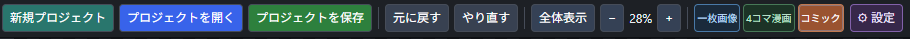

上部の「一枚画像」「4コマ漫画」「コミック」で編集モードを切り替えます。各モードは別々のワークスペースとして保持されるため、切り替えても他モードのレイヤーやページ画像は消去されません。`.sbeproj`には3モードの編集状態をまとめて保存しますが、モード間でレイヤーを直接移動する機能はありません。

### 一枚画像

キャンバス背景の上へ複数の画像レイヤーとSpeech Bubbles、Text、SFX、Stamps、Frames、Emphasis Linesを配置するモードです。画像レイヤーは表示、ロック、並び替え、複製、削除に対応し、倍率、位置、回転、不透明度を個別に調整できます。キャンバス背景は任意色または透明にできます。4コマ専用のページ画像トレイは表示されません。

キャンバス背景では、単色、グラデーション、網点、線、チェック、花柄、ピクセル、タイル、スキャンライン、雲、マーブル、セルノイズ、タービュランス、フラクタルノイズ、木目、立体波、レンガ、編み込み、六角形、集中線、デジタル迷彩など23種類の内蔵パターンを選択できます。パターンは画像素材や外部ライブラリを使わずCanvasで生成され、画面表示と画像書き出しに同じ設定が適用されます。ユーザープリセット保存は未対応です。

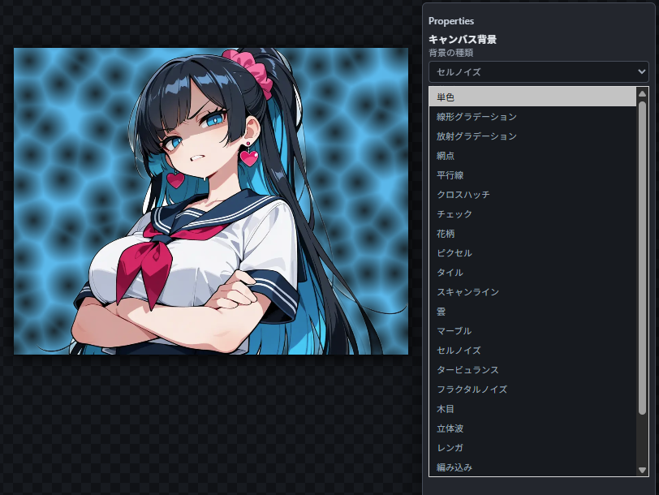

旧形式の固定背景画像は、読み込み時に通常の画像レイヤーへ移行されます。背景削除やコミック変換の結果は元画像を置換せず、新しい画像レイヤーとして追加されます。元画像は非表示で保持されるため、Layersのメニューから再表示して再編集できます。処理結果には元画像レイヤーの倍率、位置、回転、不透明度、ロック状態が引き継がれます。`.sbeproj`には画像データ、順序、表示、ロック、変形、キャンバス背景を保存します。

### 4コマ漫画

初期サイズは720×2200です。キャンバス寸法、外周余白、コマ間隔、枠線、背景色、見出しBoxをPropertiesから変更できます。見出しBoxの表示／非表示は、見出しを選択したProperties上部の「見出しを表示」で切り替えます。ページ構造とコマ画像には個別のロックがあります。

各コマの背景にも、一枚画像と同じ23種類の内蔵パターンを設定できます。パターンはコマ内へ収まり、コマ画像・トーン・枠線の下に描画されます。

### キャンバスサイズとコマ高さ

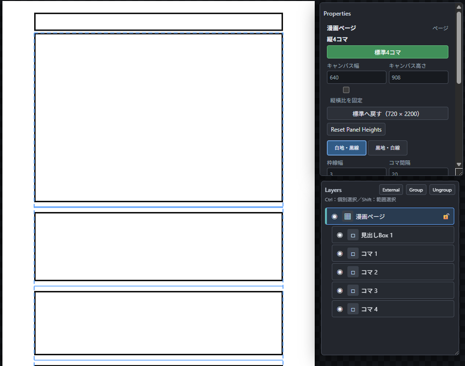

漫画ページを選択し、鍵を解除すると、Propertiesからキャンバス幅・高さを変更できます。キャンバスを拡大・縮小すると、外周余白、コマ間隔、枠線、見出しの位置と大きさも比例して調整されるため、大きな出力サイズでも4コマの見た目を保てます。

青いコマ境界を上下へドラッグすると、各コマの高さだけを自由に調整できます。`Reset Panel Heights`は4コマの高さ比率だけを均等へ戻す操作で、キャンバスサイズ、余白、コマ間隔、枠線、コマ画像の設定は変更しません。見出しは初期状態ではコマ領域の幅へ追従し、手動で移動・リサイズした後は「見出しをコマ幅へ合わせる」で再び揃えられます。

見出しBoxは背景と枠だけのレイヤーで、文字は内蔵していません。「＋ 文字を追加」または`T`で通常のTextレイヤーを追加し、見出しBoxの上へ手動で配置してください。

### コミック

4コマ漫画の操作体系を引き継ぎながら、コマ数とコマ割りを自由に編集するモードです。新規プロジェクトで「コミック」を選ぶと標準5コマで開始します。漫画ページのテンプレートから「標準5コマ」「均等6コマ」「メインコマ重視」へ切り替えることもできます。

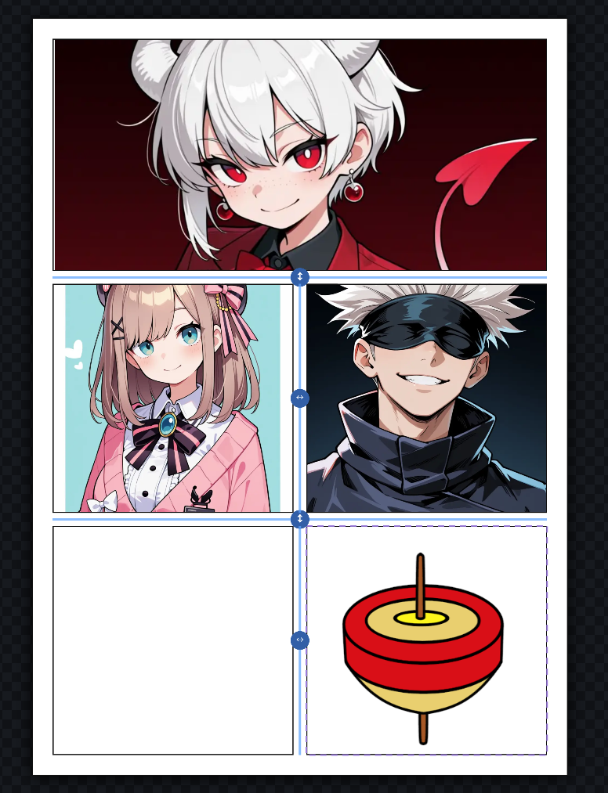

コマを選択すると縦分割・横分割でコマを増やせます。不要なコマは「表示」をOFFにして詰め、境界を選択して片側へ結合できます。コマ背景には単色、グラデーション、網点など一枚画像・4コマと共通の内蔵パターンを使えます。ページ画像トレイ、コマ内画像の移動・倍率・ロック、Speech Bubbles、Text、SFX、Stamps、Frames、Emphasis Linesも4コマと同じ考え方で利用できます。

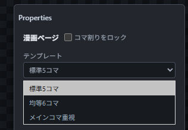

テンプレートを変更すると現在のコマ割りを作り直します。コマ内レイヤーはページ上へ移され、画像素材自体はページ画像トレイへ残りますが、コマへの配置は解除されます。作品の途中では確認ダイアログの内容を確認してから実行してください。

#### 斜め境界とスナップ

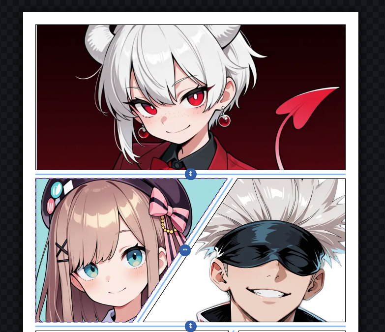

- 境界線をクリックすると両端と中央にハンドルが表示されます。
- 両端の丸ハンドルをドラッグすると、片端ずつ動かして斜め境界を作れます。
- 中央ハンドルまたは境界線をドラッグすると、角度を保ったまま境界全体を平行移動します。
- `Shift`を押しながら端点をドラッグすると15度刻みで吸着します。
- 水平／垂直へ十分近づけて離すと通常操作でも直線へ吸着します。吸着を避けたい場合は`Alt`を押したまま離します。

コマ割りを確定した後は、Properties上部の「コマ割りをロック」をONにすると誤操作を防げます。青いガイド、端点、中央ハンドルは編集用表示であり、画像書き出しには含まれません。

## 4コマへ画像を入れる

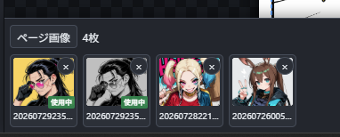

1. 「4コマ漫画」を選びます。
2. 下部の「ページ画像」を開き、「＋ 画像を追加」または画像ファイルのドロップでPNG／JPEG／WebPを読み込みます。
3. ページ画像のサムネイルを掴み、配置したいコマへ直接ドロップします。
4. 同じサムネイルを別のコマへもう一度ドロップすると、同じ画像を複数のコマで使用できます。

空コマの中央には画像選択ボタンを表示しません。誤操作を避けるため、空コマのクリックではファイル選択を開かず、ページ画像のサムネイルをドラッグして配置します。

ページ画像は素材置き場です。現在選択中の画像は太い赤枠と「SELECTED」、コマで使用中の画像は緑の「使用中」バッジで区別します。サムネイル右上の×で削除でき、使用中の画像を削除すると、その画像を使用しているコマからも外れます。

## コミック変換

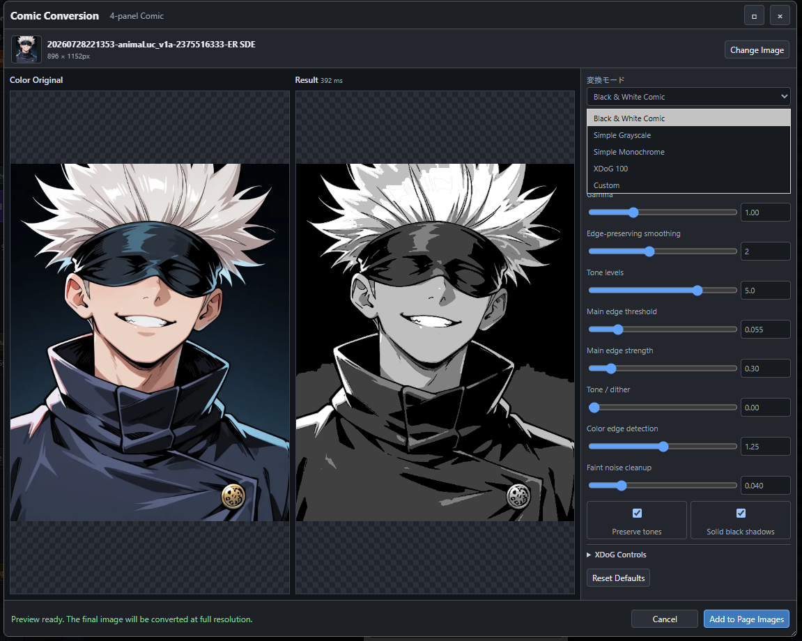

左パネル上部の「コミック変換を開く」から、カラー画像を漫画向けに変換できます。左パネルでは変換元だけを確認し、変換モードは開いた画面で選びます。単純グレースケール（初期値）、白黒コミック、単純モノクロ、XDoG 100を選択できます。プレビューは長辺768pxで高速に確認し、適用時は元画像の解像度でPNGへ再変換します。

- 4コマ漫画: 選択中のページ画像を優先し、次に選択コマの画像を使用します。変換結果は「ページ画像へ追加」され、コマへは自動配置されません。
- 一枚画像: 選択中の画像レイヤーを変換元にし、結果を新しい画像レイヤーとして追加します。元画像は非表示で保持され、位置や倍率などの変形も維持されます。
- 共通: ページ画像一覧、ドラッグ＆ドロップ、ファイル選択、Ctrl+Vから変換元を変更できます。

変換画面は移動・サイズ変更・最大化に対応し、前回の位置と寸法を記憶します。明るさ、コントラスト、階調、輪郭、網点、色境界、ノイズ除去を調整でき、XDoGの詳細設定は折りたたまれています。「初期設定に戻す」で単純グレースケールの初期値へ戻せます。

プレビュー用の中間画像はメモリだけで処理され、Windowsの一時フォルダーへ保存されません。4コマの変換結果は「ページ画像へ追加」を押した場合だけプロジェクト画像として保存されます。一枚画像の変換前履歴は文書ごとに最大5件、全体512MB、30日まで保持され、Settingsの「ページ画像・変換履歴」から削除できます。

## AI背景削除

左パネル上部の「背景削除を開く」から、選択中の画像をAIで透過できます。元画像と透過結果を並べて確認し、「復元ブラシ」と「消しゴムツール」、マスク拡張・縮小、境界ぼかし、穴埋め、小領域除去でマスクを補正できます。画面は移動・サイズ変更・最大化に対応しています。

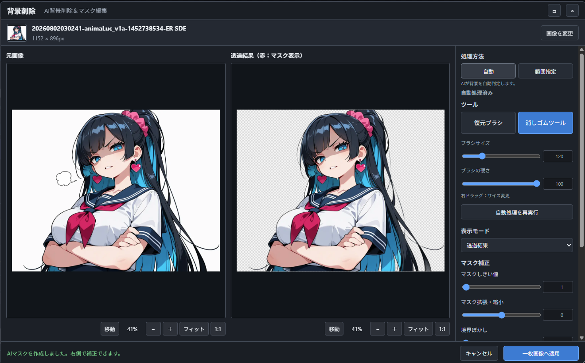

- 4コマ漫画: 選択中のページ画像を優先し、次に選択コマの画像を使用します。結果は新しいページ画像として追加され、コマへは自動配置されません。
- 一枚画像: 選択中の画像レイヤーから透過結果を作り、新しい画像レイヤーとして追加します。元画像は非表示で保持され、Speech Bubbles、Text、SFX、Stampsなどのレイヤーと4コマ漫画側の状態も維持されます。
- 初回のみ: 確認後にisnet-animeモデル（約168MB）をGitHub Releaseから取得します。モデルはローカルへ保存され、推論もWindows PC上のCPUで実行されます。
- モデル管理: Settingsの「AI背景削除モデル」で取得状態の確認、取得、中止、削除ができます。

### 自動選択とエッジカラー補正

自動選択ツールは、クリック位置につながる近い色の領域を許容値に応じて選択します。単色背景や残った背景色をまとめて消したい場合に使い、色むらが残る場合は追加でクリックします。復元ブラシ／消しゴムツール、Undo／Redoと組み合わせて調整できます。

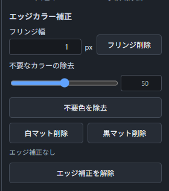

- フリンジ削除: 指定幅の輪郭RGBを内側の色へ補正します。
- 不要色を除去: 強さに応じて輪郭へ混ざった背景色を減らします。ボタンはトグルで、もう一度押すと解除します。
- 白マット削除／黒マット削除: 白または黒の背景との合成で生じた縁色を補正します。両機能は同時に有効になりません。
- エッジ補正を解除: エッジ補正だけを初期状態へ戻します。

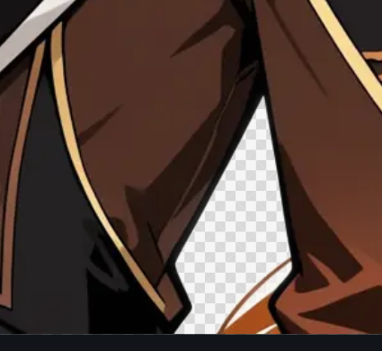

補正は元画像と確定マスクから毎回再計算する非破壊方式です。マスク形状とアルファを保ったまま輪郭のRGBを調整し、プレビューと「一枚画像へ適用」／「ページ画像へ追加」のPNG結果へ同じ処理を使います。細い髪や半透明部分では画像に合わせて強さを調整してください。

画像は背景削除のために外部へ送信されません。ネットワーク通信は、ユーザーが許可した場合のモデル取得にだけ使用します。モデルの配布元とライセンスは[THIRD-PARTY-NOTICES.md](THIRD-PARTY-NOTICES.md)を確認してください。

### 不要物の修復（IOPaintShop）

画像内の不要物や生成時の乱れを修正したい場合は、姉妹ツール「[IOPaintShop](https://github.com/ukr8b3g-cmyk/IOPaintShop)」で画像を修復してから、本エディターへ読み込む方法を推奨します。IOPaintShopで書き出したPNG／JPEG／WebPは、一枚画像では画像レイヤー、4コマ漫画ではページ画像として追加できます。元画像を残したまま別画像を追加するため、比較や復元も容易です。

<a href="https://github.com/ukr8b3g-cmyk/IOPaintShop">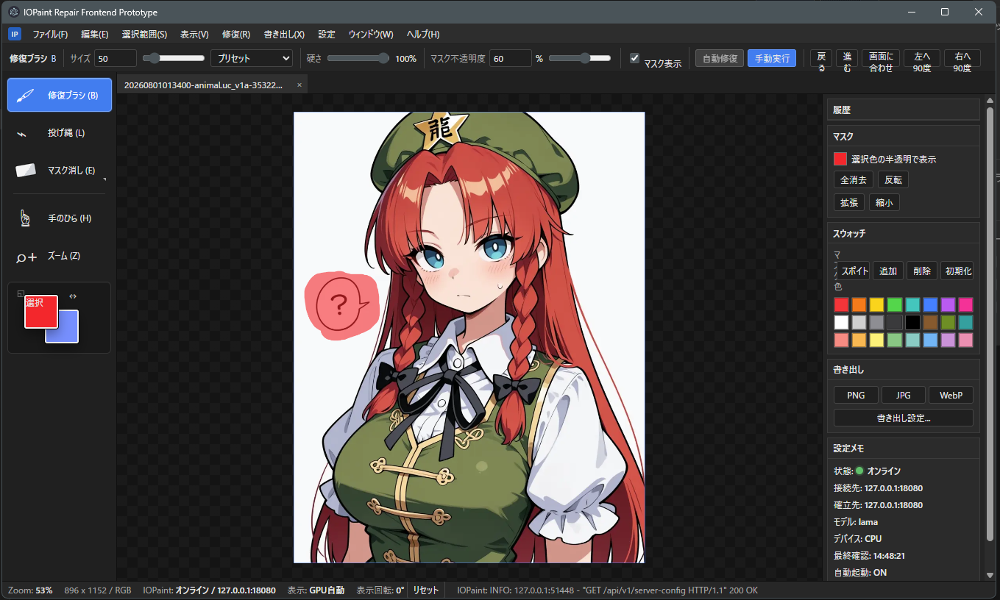</a>

### 背景素材の作成（Background Prompter）

背景画像を新たに用意したい場合は、Forge Neo向けの[Background Prompter](https://github.com/ukr8b3g-cmyk/Background-Prompter)を利用できます。多数の背景向けプロンプトプリセットから場面や雰囲気に合う背景を作成し、本エディターでは一枚画像の画像レイヤーまたは4コマ漫画のページ画像として読み込めます。

プリセットは背景制作の補助であり、生成画像の著作権・商用利用の可否を保証するものではありません。使用するモデル、追加学習モデル、参照画像、生成サービスの規約および出力条件を確認してください。

<a href="https://github.com/ukr8b3g-cmyk/Background-Prompter">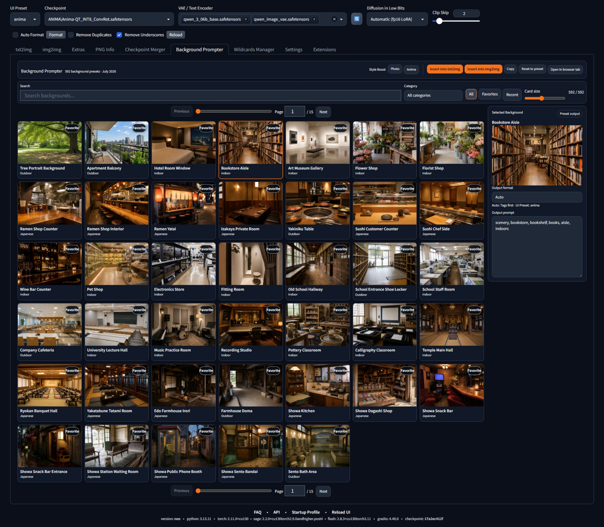</a>

### 背景削除画面の操作

| 操作 | 動作 |
| --- | --- |
| `B` | 復元ブラシへ切り替え |
| `E` | 消しゴムツールへ切り替え |
| 右ドラッグを横方向へ移動 | ブラシサイズを変更 |
| ホイール | 左右のプレビューを同じ倍率でズーム |
| 中ボタンドラッグ、または「移動」 | 左右のプレビューを同じ量だけパン |
| `Ctrl+0` | フィット表示 |
| `Ctrl+Z` | マスク編集を元に戻す |
| `Ctrl+Y`／`Ctrl+Shift+Z` | マスク編集をやり直す |

ブラシカーソルと実際のマスク描画は同じ画像座標を使用します。画像の実寸解像度は維持され、確定時に編集内容を元解像度で適用します。

## ショートカットとマウス操作

### キーボード

| 操作 | 動作 |
| --- | --- |
| `Ctrl+N` | 新規プロジェクト |
| `Ctrl+S` | レイアウトを保存 |
| `Ctrl+Shift+S` | 画像を書き出す |
| `Ctrl+Z` | 元に戻す |
| `Ctrl+Y`／`Ctrl+Shift+Z` | やり直す |
| `Ctrl+C`／`Ctrl+V` | 選択レイヤーをコピー／貼り付け |
| `Ctrl+J` | 選択レイヤーを複製 |
| `Ctrl+G`／`Ctrl+Shift+G` | グループ化／グループ解除 |
| `T` | 選択対象に応じてTextレイヤーを追加 |
| `Delete`／`Backspace` | 選択対象を削除 |
| 矢印キー／Shift＋矢印キー | 1px／10pxずつ移動 |
| `Ctrl+0` | キャンバスを全体表示 |
| `Escape` | パス編集、選択、開いている一部パネルを解除 |

### マウス

| 操作 | 動作 |
| --- | --- |
| マウスホイール | キャンバス全体を拡大・縮小 |
| 中ボタン長押し＋ドラッグ | キャンバス全体を移動 |
| Space＋左ドラッグ | キャンバス全体を移動 |
| コマ画像を選択してCtrl＋ホイール | そのコマ内の画像だけを拡大・縮小 |
| ロックされていないコマ画像を左ドラッグ | コマ内の画像位置を調整 |
| コマ上で右クリック | 「画像位置を中央へ戻す」「画像を外す」を表示 |
| コミックの境界端をドラッグ | 片端を動かして境界角度を変更 |
| コミックの境界中央／境界線をドラッグ | 角度を保ったまま平行移動 |
| `Shift`＋コミック境界端をドラッグ | 15度刻みで角度を吸着 |
| `Alt`を押したままコミック境界端を離す | 水平／垂直への自動吸着を一時的に無効化 |
| LayersでCtrl＋クリック | レイヤーを個別に追加選択／選択解除 |
| LayersでShift＋クリック | 起点から範囲選択 |

Ctrl＋ホイールで変更されるのはコマ内画像だけです。背景と素材を含むキャンバス全体の表示倍率は通常のホイールで変更します。

`T`は「＋ 文字を追加」と同じ操作です。吹き出しを選択して押すと、同じコマ内の吹き出しより上のレイヤーへ、現在見えている吹き出し付近に追加します。コマを選択して押すとそのコマ内へ、対象を選択していない場合はページ上の表示範囲中央付近へ追加します。入力欄や文字編集欄にカーソルがある間はショートカットが発動しません。

### 複数選択

一枚画像では、LayersでCtrl＋クリックするとレイヤーを個別に追加／解除し、Shift＋クリックすると範囲選択できます。複数選択したレイヤーは同じ移動量で移動し、共通の選択範囲を基準に拡大縮小できます。表示、ロック、削除もまとめて操作でき、ロック中のレイヤーは変形対象から除外されます。複数選択は一時的な選択状態で、恒久的なグループとは別です。

4コマ漫画とコミックでは、複数のコマ画像を同じ方法で選択し、一括移動、Ctrl＋ホイールによる拡大縮小、表示、ロック、削除を行えます。異なるコマ画像の回転は行いません。

## 漫画ページのレイヤー構造

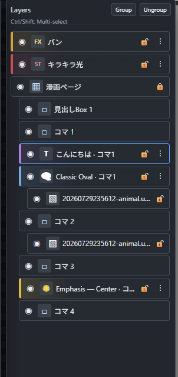

編集対象は、まずLayersでレイヤーを選択してからPropertiesで調整するのが最も確実です。キャンバス上のクリックでも選択できますが、素材が重なっている場合や文字が吹き出し内にある場合はLayersを使用してください。

「漫画ページ」はページ構造を表す親レイヤーで、通常素材と区別できる専用色で表示されます。新規ページのコマ割りは初期状態ではロックされていません。コマ境界や見出しの調整が終わったら、Properties上部またはLayersの鍵でロックしてください。

4コマとコミックでは、素材を「ページ上」または「特定のコマ内」へ配置できます。配置先によって、コマ枠でクリップするかどうかが変わります。

### ページ上へ置く

Layersで素材レイヤーを「漫画ページ」の行へドロップします。素材はページ上レイヤーになり、コマ枠をまたいだり、枠外へはみ出したりできます。

### 特定のコマ内へ置く

たとえばオノマトペをコマ2だけに置く場合は、SFXレイヤーをLayersの「コマ2」の行へドロップします。レイヤーはコマ2の配下に入り、表示はコマ2の枠内でクリップされます。

コマ画像の行へドロップする場合は、位置によって描画順を選べます。

- コマ画像行の上半分へドロップ: コマ画像より上に表示
- コマ画像行の下半分へドロップ: コマ画像より下に表示

不透明なコマ画像より下へ置いた素材は画像に隠れます。通常のSpeech Bubble、Text、SFX、Stampはコマ画像より上へ配置してください。Emphasis Linesなどを画像の背面へ置きたい場合に下側を使います。

### ロックの種類

- 漫画ページの鍵: コマ境界や見出しBoxなどページ構造の編集をロック
- コマ画像の鍵: その画像の移動とCtrl＋ホイールによる拡大・縮小をロック
- 通常素材の鍵: Speech Bubble、Text、SFX、Stampなど個別レイヤーの移動・編集をロック

ロック中でも、表示／非表示やレイヤー構造を確認できます。編集したい対象の鍵だけを解除してください。

### Properties／Layersのフローティングパネル

PropertiesとLayersは、キャンバス上で常時独立して表示されるフローティングパネルです。各パネルの上部をドラッグして移動し、パネルのリサイズ領域をドラッグして大きさを変更できます。位置と大きさは自動保存され、次回起動時にも復元されます。

標準配置へ戻す場合は、Settings → Editor・復元 →「UIレイアウトを初期状態へ戻す」を使用します。リセットされるのはパネル配置と表示状態だけで、作品レイヤー、ページ画像、ユーザープリセット、書き出し設定は削除されません。

## 素材パネルとDrawer

Speech Bubbles、SFX、Stamps、Frames、Emphasis Linesでは、左側にクイック素材を2件表示します。お気に入りを登録している場合はお気に入りが優先され、未登録時は代表的な素材が表示されます。

### Speech Bubbles

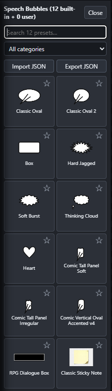

「Browse Speech Bubbles…」を開くと、吹き出しの検索、カテゴリ選択、お気に入り登録、JSONのImport／Exportができます。コマを選択してから吹き出しをクリックするとそのコマ内へ追加されます。DrawerからキャンバスまたはLayersの目的の位置へ直接ドラッグすることもできます。

### Stamps

「Browse Stamps…」を開くと、検索、カテゴリ、並べ替え、お気に入り、My Presetsと組み込み素材を確認できます。SFXやStampを特定のコマ内だけで使う場合は、その素材レイヤーをLayersで対象コマの配下へ移動してください。漫画ページの上へ置くと、コマをまたぐページ上素材として扱われます。

各「Browse…」ボタンからDrawerを開くと、全素材の検索、カテゴリ選択、お気に入り登録ができます。素材はクリックで中央へ追加するほか、キャンバスやLayersの配置先へドラッグできます。

4コマ漫画ではコマまたはコマ画像を選んでからSpeech Bubbleをクリックすると、そのコマの画像より上へ追加され、コマ枠でクリップされます。新規ページで配置先を選んでいない場合はコマ1が追加先です。左パネルの「追加先」で現在の追加先を確認できます。

「＋ Add Text」はSpeech Bubblesの直下にあります。Speech Bubbleを選択して追加すると、同じコマ内で吹き出しの直上レイヤーへ配置されます。初期位置は、現在見えている吹き出し付近の選択しやすい場所です。配置後は吹き出し内へ固定されず、文字を吹き出しの外へはみ出させることもできます。コマを選択した場合はそのコマ内、何も選択していない場合はページ上へ追加されます。

### Textの編集

TextレイヤーをLayersで選択すると、文字内容、フォント、サイズ、Text／Outline色、横書き／縦書き、文字揃え、Auto Fit、文字装飾、4コマ内の配置、Transform、EffectsをPropertiesで編集できます。キャンバス上で選びにくい場合は、Layersの`T`アイコンが付いた行を選択してください。

Font欄を開くと、システムフォントを言語、最近使用、お気に入りで絞り込めます。サンプル表示を確認してフォントをクリックすると、選択中のTextへ適用されます。EXE版または`start.cmd`版を使用してください。HTMLを直接開いた場合はDesktop APIへ接続しないため、システムフォント一覧を取得できません。

### フォントを含むプロジェクトの移動

プロジェクトには使用したフォントの識別情報を保存しますが、フォントファイル自体は埋め込みません。別のPCで同じ見た目を再現するには、同じフォントをそのPCにもインストールしてください。フォントが一時的に読み込めない場合も保存済みの識別情報は維持され、利用可能になった時点で再解決されます。フォントが未導入の環境では代替フォントで表示されるため、厳密な再現が必要な場合はフォントのライセンスを確認したうえで別途バックアップ・移行してください。

## おすすめSFXフォント

手描き風のオノマトペや効果文字には、同じ作者が公開している[GEKIFUDE-SFX](https://github.com/ukr8b3g-cmyk/GEKIFUDE-SFX)も利用できます。フォントをWindowsへインストールすると、EXE版または`start.cmd`版のTextフォント一覧から選択できます。

## SFX／スタンプ画像プリセット

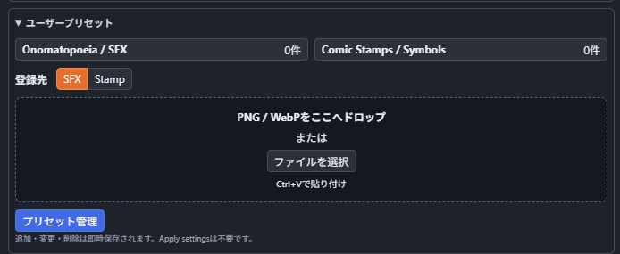

SettingsのUser Presetsを開き、登録先をSFXまたはStampから選びます。PNG／WebPを枠内へドロップするか、「ファイルを選択」またはCtrl+Vで画像を読み込んで登録します。

登録画面では、名前・種類・サイズ・透明度、Fill／Outline、Drop Shadow、Outer Glowを設定できます。登録後も「プリセット管理」から再編集、画像差し替え、別名保存、削除、旧世代素材の整理ができます。保存した初期スタイルは、次回その素材を配置したときに適用されます。

## 吹き出しユーザープリセット

ShapeのBuilt-inから吹き出しを配置し、Propertiesでベジェ曲線のアンカー／ハンドル、形状調整、縦横比を編集します。`Finish Path`でパス編集を確定した後、「ユーザープリセットとして保存…」を選ぶとShapeの`My Presets`へ追加され、クリックまたはCanvasへのドラッグで再利用できます。Built-inは読み取り専用で上書きされません。

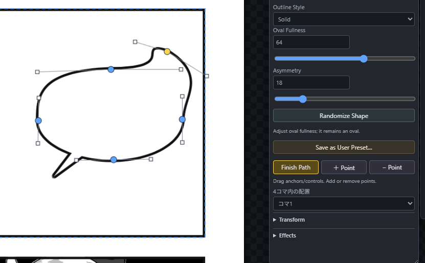

My Presetsから配置した吹き出しは「変更を保存…」で元のユーザープリセットを更新し、「別名で保存…」で複製できます。Settingsの「吹き出しプリセット管理」では名前変更、複製、削除、JSON読み込み／書き出しを行えます。ここには画像ドロップ登録欄はありません。

Save Layoutと`.sbeproj`は現在の作品配置を保存する機能です。吹き出しを別の作品でも再利用する場合は、Propertiesから吹き出しユーザープリセットとして保存してください。

## Settings / Export

Settingsではテーマと言語を即時切替できます。「画像未読込時に『画像をドロップ』を表示」で、空の一枚画像キャンバスに表示する読み込み案内を切り替えられます。初期値は表示です。Exportでは出力フォルダーを参照ボタンで指定し、指定先への自動保存または前回選択したフォルダーの記憶を選べます。PNG／JPEG／WebP、品質・圧縮、ファイル名、日付サブフォルダー、Overlay PNG、同名ファイルの世代バックアップも設定できます。

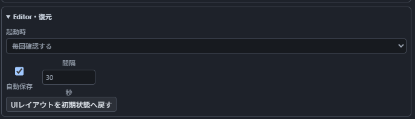

Editor・復元では、起動時に毎回確認する／前回の編集を復元する／新規で開く動作を選び、自動保存と保存間隔（5～3600秒）を設定できます。「UIレイアウトを初期状態へ戻す」はパネル配置だけを戻し、作品やユーザープリセットは削除しません。

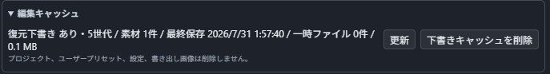

編集キャッシュでは、復元下書き、保存世代、素材数、最終保存日時、使用量を確認できます。「更新」で再取得し、「下書きキャッシュを削除」で不要な復元データを整理できます。プロジェクト、ユーザープリセット、書き出した画像は削除されません。

「ページ画像・変換履歴」では、ページ画像の件数・容量・未使用件数と、一枚画像の変換履歴の件数・容量を確認できます。未使用画像だけの整理と、変換履歴だけの削除を分けて実行できます。使用中のページ画像と現在の一枚画像は削除されません。

Properties／Layersの位置と大きさは自動保存されます。標準配置へ戻す場合は、Settingsの「UIレイアウトを初期状態へ戻す」を使用してください。

日本語／英語の切り替えは主要なProperties、Layers、4コマ・コミック設定、ページ画像、コミック変換、背景削除、Settings、フォント画面へ即時反映されます。切り替えても既存の文字レイヤー内容やユーザープリセット名は変更されません。新規文字レイヤーの初期文字だけが、日本語では「こんにちは」、英語では「Hello!」になります。

### レイアウト保存と画像書き出し

- Save Layout: 現在のレイヤー構成と編集状態を保存
- Export Image: Canvasで見えている合成結果をPNG／JPEG／WebPとして書き出し
- `.sbeproj`: レイアウトとページ画像をまとめて保存し、後から再編集

Settingsで固定の出力先を指定できます。毎回保存先を選択する設定にした場合は、Export Imageのたびに保存先を選びます。

## HTML

EditorのUIソースは`web\speech-bubble-editor.html`ですが、直接表示は旧版互換・UI確認用です。現在の機能を利用する場合は`start.cmd`またはインストーラー版EXEから起動してください。直接表示では、システムフォント、プロジェクト保存、Desktop SettingsなどDesktop APIが必要な機能を利用できません。

## 保存場所

既定では、旧Desktop版との設定・プリセット・キャッシュ互換性を保つため`%LOCALAPPDATA%\SpeechBubbleComicEditorApp`を引き続き使用します。ソース版を`python -m desktop_app.main --portable`で起動した場合はプロジェクト内の`data`を使用します。

## ライセンス

本ソフトウェアは[MIT License](LICENSE)で公開しています。第三者コンポーネント・モデルのライセンスは[THIRD-PARTY-NOTICES.md](THIRD-PARTY-NOTICES.md)を参照してください。
